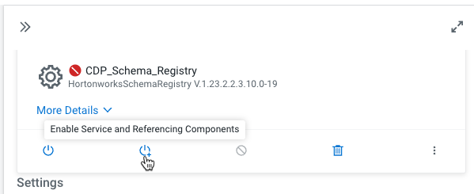
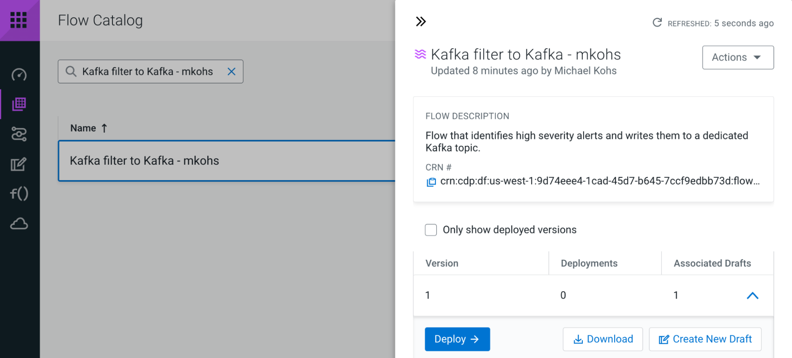

# Use Case 1 - Reading and filtering a stream of syslog data

You have been tasked with filtering a noisy stream of syslog events which are available in a Kafka topic. The goal is to identify critical events and write them to another Kafka topic.


## 1.1 Open ReadyFlow & start Test Session

1. Navigate to **DataFlow**
2. Navigate to the **ReadyFlow Gallery**
3. Explore the ReadyFlow Gallery

---
**Info:**

The ReadyFlow Gallery is where you can find out-of-box templates for common data movement use cases. You can directly create deployments from a ReadyFlow or create new drafts and modify the processing logic according to your needs before deploying.

---

4. Search for the “Kafka filter to Kafka” ReadyFlow.
5. Click on “Create New Draft” to open the ReadyFlow in the Designer
6. Select the only available workspace and give your draft a name
7. Click Create. You will be forwarded to the Designer
8. Start a Test Session by either clicking on the _start a test session_ link in the banner or going to _Flow Options_ and selecting _Start_ in the Test Session section.
9. In the Test Session creation wizard, select the latest NiFi version and click _Start Test Session_. Notice how the status at the top now says “Initializing Test Session”.

---
**Info:**

Test Sessions provision infrastructure on the fly and allow you to start and stop individual processors and send data through your flow. By running data through processors step-by-step and using the data viewer as needed, you’re able to validate your processing logic during development in an iterative way without having to treat your entire data flow as one deployable unit.

---

## 1.2 Modifying the flow to read syslog data

The flow consists of three processors and looks very promising for our use case. The first processor reads data from a Kafka topic, the second processor allows us to filter the events before the third processor writes the filtered events to another Kafka topic. All we have to do now to reach our goal is to customize its configuration to our use case.

### 1. Provide values for predefined parameters

- a. Navigate to _Flow Options_ → _Parameters_
- b. Select all parameters that show _No value set_ and provide the following values

| Name                       | Value                                                                                                               |
| -------------------------- | ------------------------------------------------------------------------------------------------------------------- |
| CDP Workload User          | srv_nifi-kafka-ingest                                                                                               |
| CDP Workload User Password | \<Copy the value for 'nifi-kafka-ingest-password' from Trial Manager homepage\>                                     |
| Data Input Format          | AVRO                                                                                                                |
| Data Output Format         | JSON                                                                                                                |
| Filter Rule                | SELECT * FROM FLOWFILE                                                                                              |
| Kafka Broker Endpoint      | \<Comma-separated list of Kafka Broker addresses. Copy the value for 'kafka_broker' from Trial Manager homepage\>   |
| Kafka Consumer Group ID    | cdf                                                                                                                 |
| Kafka Destination Topic    | syslog_critical                                                                                                     |
| Kafka Producer ID          | cdf                                                                                                                 |
| Kafka Source Topic         | syslog_avro                                                                                                         |
| Schema Name                | syslog                                                                                                              |
| Schema Registry Hostname   | \<Hostname of Schema Registry service. Copy the value for 'schema_registry_host_name' from Trial Manager homepage\> |

- c. Click _Apply Changes_ to save the parameter values

### 2. Start Controller Services

- a. Once your test session has started, navigate to _Flow Options_ → _Services_
- b. Select _CDP_Schema_Registry_ service and click _Enable Service and Referencing Components_ action

     

- c. Start from the top of the list and enable all remaining Controller services as needed
- d. Make sure all services have been enabled

     

 Navigate back to the Flow Designer canvas by clicking on the _Back To Flow Designer_ link at the top of the screen.

### 3. *Start the _ConsumeFromKafka_* processor using the right click action menu or the _Start_ button in the configuration drawer if it hasn’t been started automatically.


### 4. Stop the *_Filter Events_* processor if it is running using the right click action menu or the _Stop_ button in the configuration drawer.


### 5. Stop the *_WriteToKafka_* processor if it is running


After starting the _ConsumeFromKafka_ processor and stopping the remaining processors, you should see events starting to queue up in the _success_ConsumeFromKafka-FilterEvents_ connection.

### 6. Verify data being consumed from Kafka

- a. Right-click on the _success_ConsumeFromKafka-FilterEvents_ connection and select _List Queue_

     

---
**Info:**

The _List Queue_ interface shows you all flow files that are being queued in this connection. Click on a flow file to see its metadata in the form of _attributes_. In our use case, the attributes tell us a lot about the Kafka source from which we are consuming the data. Attributes change depending on the source you’re working with and can also be used to store additional metadata that you generate in your flow.

---


- b. Select any flow file in the queue and click the _book_ icon to open it in the _Data Viewer_

     

---
**Info:**

The _Data Viewer_ displays the content of the selected flow file and shows you the events that we have received from Kafka. It automatically detects the data format - in this case JSON - and presents it in human readable format.

---

- c. Scroll through the content and note how we are receiving syslog events with varying severity.

     

### 7. Define filter rule to filter out low severity events

- a. Return to the Flow Designer by closing the Data Viewer tab and clicking _Back To Flow Designer_ in the _List Queue_ screen.

- b. Select the _Filter Events_ processor on the canvas. We will be using a _QueryRecord_ processor to filter out low severity events. The _QueryRecord_ processor is very flexible and can run several filtering or routing rules at once.

     

- c. In the configuration drawer, scroll down until you see the _filtered_events_ property. We are going to use this property to filter out the events. Click on the menu at the end of the row and select _Go To Parameter_.

     

- d. Once you are on the _Parameters_ view, you can see that this parameter already has a SQL query assigned to it. However it currently does not do any filtering - rather it passes through all events.

- e. Modify the parameter value to:

     ``` 
     SELECT * FROM FLOWFILE WHERE severity <= 2
     ```

     

- f. Click _Apply Changes_ to update the parameter value. Return back to the Flow Designer

- g. Start the _Filter Events_ processor using the right-click menu or the _Start_ icon in the configuration drawer.

### 8. Verify that the filter rule works

- a. After starting the _Filter Events_ processor, flow files will start queueing up in the _filtered_events-FilterEvents-WriteToKafka_ connection

     

- b. Right click the _filtered_events-FilterEvents-WriteToKafka_ connection and select _List Queue_.

- c. Select a few random flow files and open them in the Data Viewer to verify that only events with severity <=2 are present.

     

- d. Navigate back to the Flow Designer canvas.

### 9. Write the filtered events to the Kafka alerts topic

Now all that is left is to start the _WriteToKafka_ processor to write our filtered high severity events to _syslog_critical_ Kafka topic.


- a. Select the _WriteToKafka_ processor and explore its properties in the configuration drawer.
- b. Note how we are plugging in many of our parameters to configure this processor. Values for properties like _Kafka Brokers_, _Topic Name_, _Username_, _Password_ and the _Record Writer_ have all been parameterized and use the values that we provided in the very beginning.
- c. Start the _WriteToKafka_ processor using the right-click menu or the _Start_ icon in the configuration drawer.

**Congratulations!** You have successfully customized this ReadyFlow and achieved your goal of sending critical alerts to a dedicated topic! Now that you are done with developing your flow, it is time to deploy it in production!

## 1.3 Publishing your flow to the catalog

### 1. Stop the Test Session

- a. Click the toggle next to _Active Test Session_ to stop your Test Session

     

- b. Click “End” in the dialog to confirm. The Test Session is now stopping and allocated resources are being released

     

### 2. Publish your modified flow to the Catalog
- a. Open the “Flow Options” menu at the top
- b. Click “Publish” to make your modified flow available in the Catalog
- c. Append your username to the Flow Name and provide a Flow Description. Click Publish.

     

- d. You are now redirected to your published flow definition in the Catalog.

    

---
**Info:**

The _Catalog_ is the central repository for all your deployable flow definitions. From here you can create auto-scaling deployments from any version or create new drafts and update your flow processing logic to create new versions of your flow.

---

## 1.4 Creating an auto-scaling flow deployment

### 1. Locate your flow definition in the Catalog

- a. Make sure you have navigated to the _Catalog_

 

- b. If you have closed the sidebar, search for your published flow by typing _Kafka filter to Kafka_ into the search bar in the Catalog. Click on the flow definition that matches the name you gave it earlier.

 

- c. After opening the side panel, click _Deploy_, select the available environment from the drop down menu and click _Continue_ to start the Deployment Wizard.

 

### 2. Complete the Deployment Wizard

The Deployment Wizard guides you through a six step process to create a flow deployment. Throughout the six steps you will choose the NiFi configuration of your flow, provide parameters and define KPIs. At the end of the process, you are able to generate a CLI command to automate future deployments.

- a. Provide a name such as _Critical Syslogs - Prod_ to indicate the use case and that you are deploying a production flow. Click _Next_.

 

- b. The **_NiFi Configuration_** screen allows you to customize the runtime that will execute your flow. You have the opportunity to pick from various released NiFi versions.

     Change the NiFi version to the **_Previous Version_** and make sure _Automatically start flow upon successful deployment_ is checked.

     Click _Next_.

- c. The **_Parameters_** step is where you provide values for all the parameters that you defined in your flow. In this example, you should recognize many of the prefilled values from the previous exercise - including the _Filter Rule_ and our _Kafka Source_ and _Kafka Destination_ Topics.

 To advance, you have to provide values for all parameters. Select the _No Value_ option to only display parameters without default values.

 

 You should now only see one parameter - the _CDP Workload User Password_ parameter which is sensitive. Sensitive parameter values are removed when you publish a flow to the catalog to make sure passwords don’t leak.

 Provide the _CDP Workload User Password_ (the value for 'nifi-kafka-ingest password' from the Trial Manager homepage) and click _Next_ to continue.

  

- d. The **_Sizing & Scaling_** step lets you choose the resources that you want to allocate for this deployment. You can choose from several node configurations and turn on Auto-Scaling.

 Let’s choose the _Extra Small_ Node Size and turn on _Auto-Scaling_ from 1-3 nodes.

 Check the _Flow Metrics Scaling_ option that appears after _Auto-Scaling_ has been enabled. In addition to CPU based scaling, _Flow Metrics Scaling_ uses back pressure prediction based on data in your flow to make intelligent scaling choices.

  

  Click _Next_.

- e. The **_Key Performance Indicators (KPI)_** step allows you to monitor flow performance. You can create KPIs for overall flow performance metrics or in-depth processor or connection metrics.

Add the following KPI
- KPI Scope: **Entire Flow**
- Metric to Track: **Data Out**
- Alerts:
  - Trigger alert when metric is less than: **1 MB/sec**
  - Alert will be triggered when metrics is outside the boundary(s) for: **1 Minute**

   

Add the following KPI
- KPI Scope: **Processor**
- Processor Name: **ConsumeFromKafka**
- Metric to Track: **Bytes Received**
- Alerts:
  - Trigger alert when metric is less than: **512 KBytes**
  - Alert will be triggered when metrics is outside the boundary(s) for: **30 seconds**

   

   Review the KPIs and click _Next_.

   

- f. In the **Review** page, review your deployment details.

- g. Click **Deploy** to initiate the flow deployment!

- h. You are redirected to the Deployment Dashboard where you can monitor the progress of your deployment. Creating the deployment should only take a few minutes.

    

- i. Congratulations! Your flow deployment has been created and is already processing Syslog events!

     

## 1.5 Monitoring your flow deployment

#### 1. Notice how the dashboard shows you the data rates at which a deployment currently receives and sends data. The data is also visualized in a graph that shows the two metrics over time.

#### 2. Change the _Metrics Window_ setting at the top right. You can visualize as much as 24 hours.

#### 3. Click on the _Critical Syslogs - Prod_ deployment. The side panel opens and shows more detail about the deployment. On the _KPIs_ tab it will show information about the KPIs that you created when deploying the flow.

#### Using the two KPIs _Bytes Received_ and _Data Out_ we can observe that our flow is filtering out data as expected since it reads more than it sends out.

 

#### 4. Switch to the _System Metrics_ tab where you can observe the current CPU utilization rate for the deployment. Our flow is not doing a lot of heavy transformation, so CPU utilization shouldn’t be too high.

#### 5. Close the side panel by clicking anywhere on the Dashboard.

#### 6. Notice how your _Critical Syslogs - Prod_ deployment shows _Concerning Health_ status. Hover over the warning icon and click _View Details_.

 

#### 7. You will be redirected to the _Alerts_ tab of the deployment. Here you get an overview of active and past alerts and events. Expand the Active Alert to learn more about its cause.


#### After expanding the alert, it is clear that it is caused by a KPI threshold breach for sending less than 1MB/s to external systems as defined earlier when you created the deployment.

## 1.6 Managing your flow deployment

#### 1. Click on the _Critical Syslogs - Prod_ deployment in the Dashboard. In the side panel, click _Manage Deployment_ at the top right.

 

#### 2. You are now being redirected to the _Deployment Manager_. The Deployment Manager allows you to reconfigure the deployment and modify KPIs, modify the number of NiFi nodes or turn auto-scaling on/off or update parameter values.

 

#### 3. Explore NiFi UI for deployment. Click the _Actions_ menu and click on _View in NiFi_.

 

#### 4. You are being redirected to the NiFi cluster running the flow deployment. You can use this view for in-depth troubleshooting. Users can have read-only or read/write permissions to the flow deployment.

 

#### 5. Go back to the Deployment Manager expand the Actions menu and click on _Change NiFi Runtime Version_


#### 6. Looks like we’re running an older version of NiFi. Let’s upgrade to the latest! Select the latest version from the dropdown and click “Update”.

#### Note: If you chose the latest NiFi version when creating the deployment, you can use the _Update_ action to downgrade to the previous NiFi version too.

#### You are being redirected to the Dashboard and can monitor the upgrade process. Upgrading NiFi versions is as simple as that! One click!


### **Congratulations**, you have completed the first use case! While the NiFi version of your deployment is being upgraded, feel free to proceed to the [next use case](02_kafka_iceberg.md)!


