# Use Case 2 - Writing critical syslog events to Apache Iceberg for analysis

A few weeks have passed since you built your data flow with DataFlow Designer to filter out critical syslog events to a dedicated Kafka topic. Now that everyone has better visibility into real-time health, management wants to do historical analysis on the data. Your company is evaluating Apache Iceberg to build an open data lakehouse and you are tasked with building a flow that ingests the most critical syslog events into an Iceberg table. Visit the [Cloudera YouTube channel](https://youtu.be/oqaT7FDd0Fc?t=1590) for a video walkthrough of this use case.

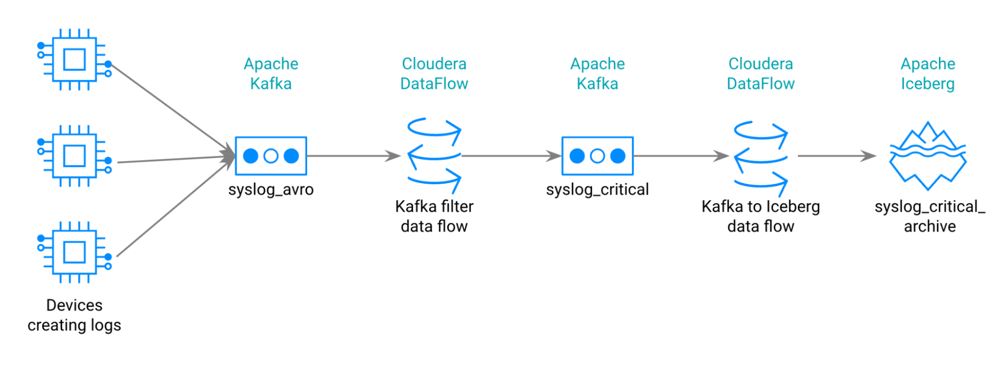

## 2.1 Open ReadyFlow & start Test Session

1. On the CDP Public Cloud Home Page, navigate to **DataFlow**
2. Navigate to the **ReadyFlow Gallery**
3. Explore the ReadyFlow Gallery
4. Search for the “Kafka to Iceberg” ReadyFlow.

 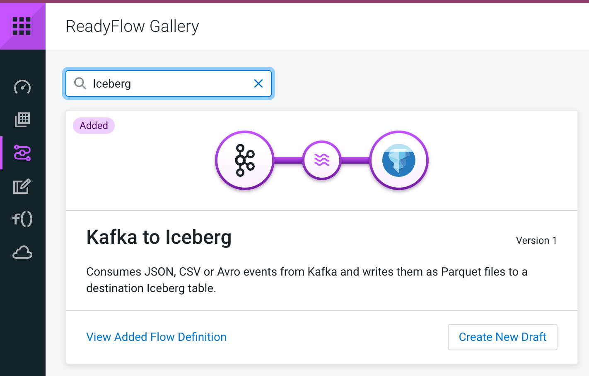

5. Click on “Create New Draft” to open the ReadyFlow in the Designer
6. Select the only available workspace and give your draft a name
7. Click "Create". You will be forwarded to the Designer
8. Start a Test Session by either clicking on the _start a test session_ link in the banner or going to _Flow Options_ and selecting _Start_ in the Test Session section.
9. In the Test Session creation wizard, confirm the latest NiFi version is selected and click _Start Test Session_. Notice how the status at the top now says “Initializing Test Session”.

   Note: Test Session initialization should take about 5-10 minutes.

## 2.2 Modifying the flow to read syslog data

The flow consists of three processors and looks very promising for our use case. The first processor reads data from a Kafka topic, the second processor gives us the option to batch up events and create larger files which are then written out to Iceberg by the PutIceberg processor. All we have to do now to reach our goal is to customize its configuration to our use case.

### 1. Provide values for predefined parameters

- a. Navigate to _Flow Options_ → _Parameters_
- b. Select all parameters that show _No value set_ and provide the following values

     Note: The parameter values that need to be copied from the [Trial Manager homepage](https://console.us-west-1.cdp.cloudera.com/trial/#/postRegister?pattern=CDP_DATA_DISTRIBUTION_AND_STREAM_ANALYTICS&trial=cdp_paas) are found by selecting _Manage Trial_ in the upper right corner and then selecting _Configurations_. See screenshots below.

| Name                       | Value                                                                                                               |
| -------------------------- | ------------------------------------------------------------------------------------------------------------------- |
| CDP Workload User          | srv_nifi-kafka-ingest                                                                                               |
| CDP Workload User Password | \<Copy the value for 'nifi-kafka-ingest-password' from [Trial Manager homepage](https://console.us-west-1.cdp.cloudera.com/trial/#/postRegister?pattern=CDP_DATA_DISTRIBUTION_AND_STREAM_ANALYTICS&trial=cdp_paas)>                                      |
| Data Input Format          | JSON                                                                                                                |
| Hive Catalog Namespace     | \<There is a value set. Change from 'default' to 'syslog'\>                                                             |
| Iceberg Table Name         | syslog_critical_archive                                                                                             |
| Kafka Broker Endpoint      | \<Comma-separated list of Kafka Broker addresses. Copy the value for 'kafka_broker' from [Trial Manager homepage](https://console.us-west-1.cdp.cloudera.com/trial/#/postRegister?pattern=CDP_DATA_DISTRIBUTION_AND_STREAM_ANALYTICS&trial=cdp_paas)\>   |
| Kafka Consumer Group ID    | cdf                                                                                                                 |
| Kafka Source Topic         | syslog_critical                                                                                                     |
| Schema Name                | syslog                                                                                                              |
| Schema Registry Hostname   | \<Hostname of Schema Registry service. Copy the value for 'schema_registry_host_name' from [Trial Manager homepage](https://console.us-west-1.cdp.cloudera.com/trial/#/postRegister?pattern=CDP_DATA_DISTRIBUTION_AND_STREAM_ANALYTICS&trial=cdp_paas)\> |

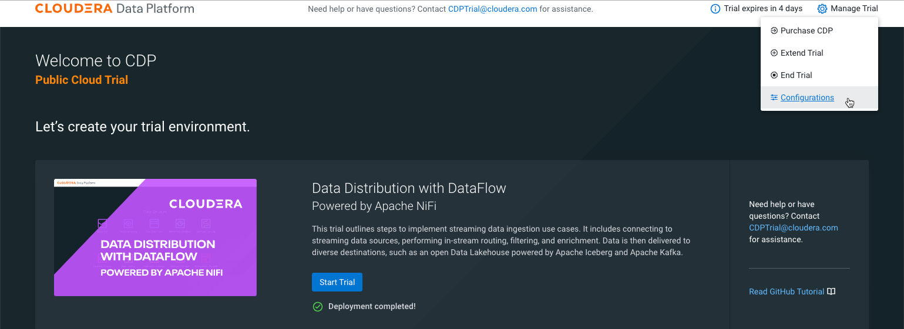

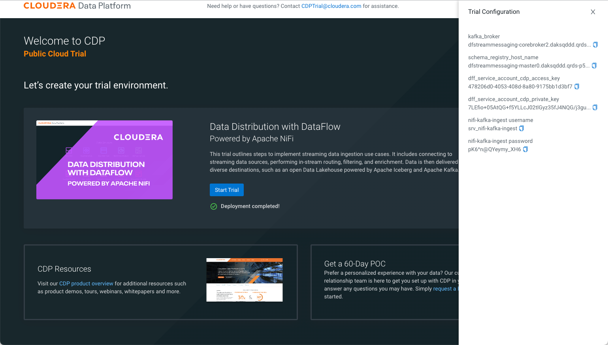

- c. Click _Apply Changes_ to save the parameter values

### 2. Start Controller Services

- a. After your test session has started successfully, navigate to _Flow Options_ → _Services_
- b. Select _CDP_Schema_Registry_ service and click _Enable Service and Referencing Components_ action

     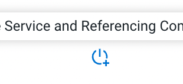

- c. Start from the top of the list and enable all remaining Controller services as needed
- d. Make sure all services have been enabled

     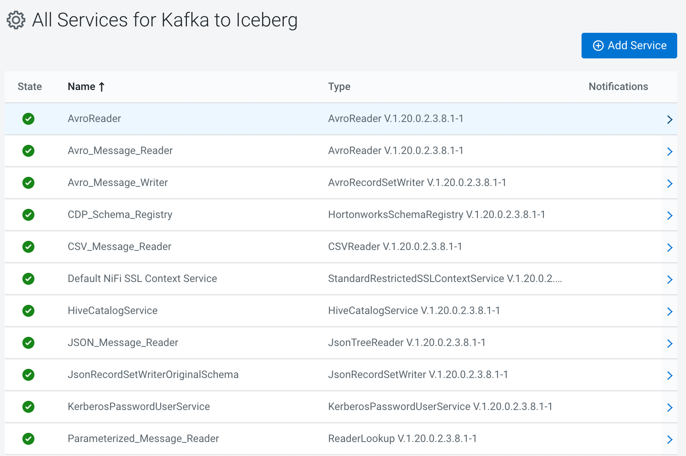

 Navigate back to the Flow Designer canvas by clicking on the _Back To Flow Designer_ link at the top of the screen.

### 3. **Stop the  _ConsumeFromKafka_** processor using the right click action menu or the _Stop_ button in the configuration drawer if it has been started automatically.

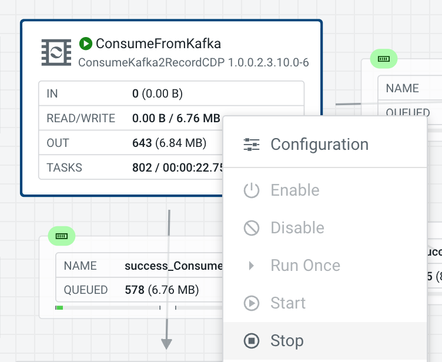

## 2.3 Changing the flow to modify the schema for Iceberg integration

Our data warehouse team has created an Iceberg table that they want us to ingest the critical syslog data in. A challenge we are facing is that not all column names in the Iceberg table match our syslog record schema. So we have to add functionality to our flow that allows us to change the schema of our syslog records. To do this, we will be using the _JoltTransformRecord_ processor.

1. Add a new _JoltTransformRecord_ to the canvas by dragging the processor icon to the canvas.

   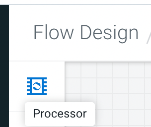

2. In the _Add Processor_ window, select the _JoltTransformRecord_ type and name the processor _TransformSchema_.

   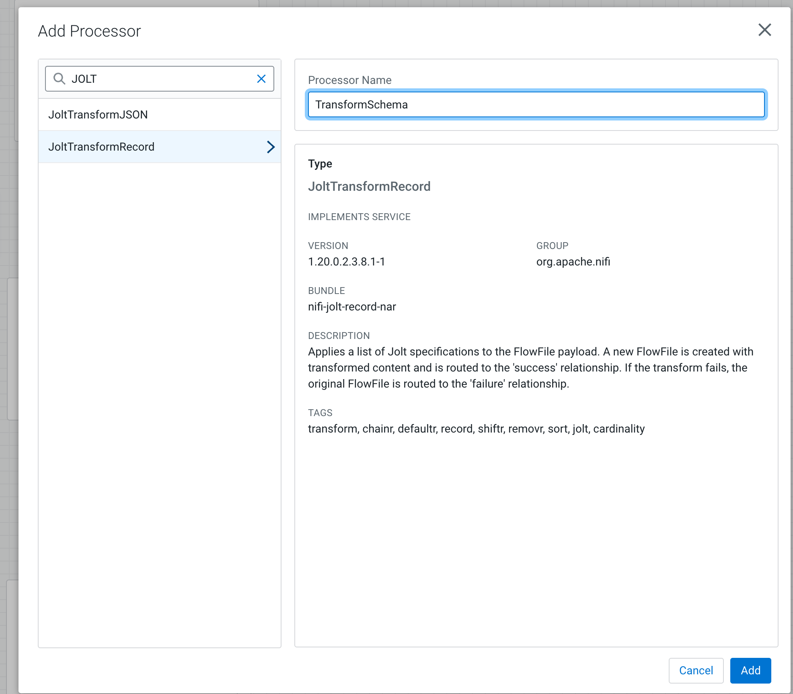

3. Validate that your new processor now appears on the canvas.

   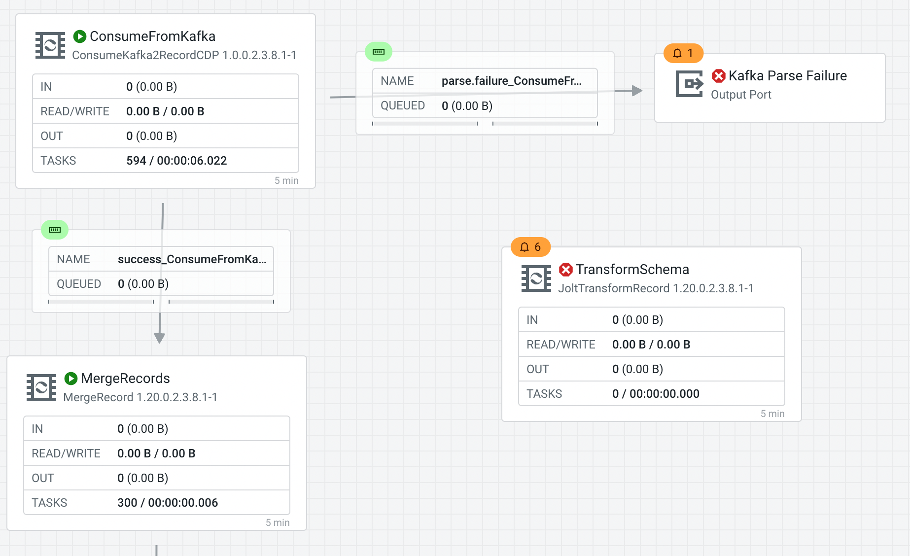

4. Create connections from _ConsumeFromKafka_ to _TransformSchema_ by hovering over the _ConsumeFromKafka_ processor and dragging the arrow that appears to _TransformSchema_. Pick the _success_ relationship to connect.

   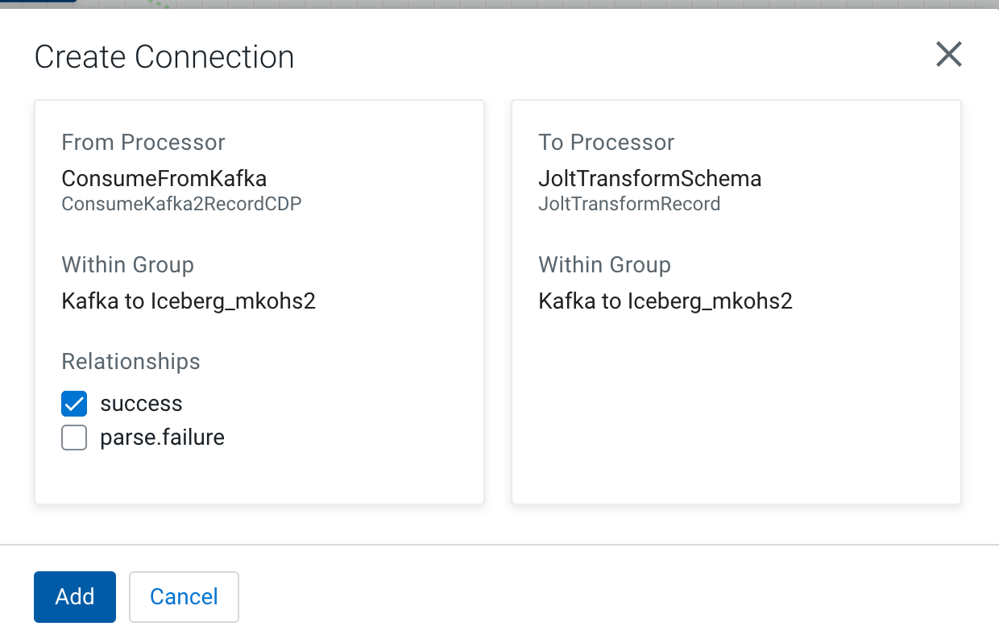

   Now connect the _success_ relationship of TransformSchema to the MergeRecords processor.

   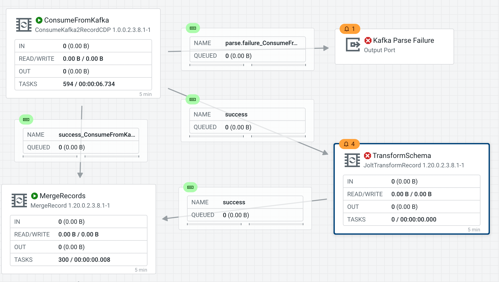

5. Now that we have connected our new _TransformSchema_ processor, we can delete the original connection between _ConsumeFromKafka_ and _MergeRecords_.

   Make sure that the _ConsumeFromKafka_ processor is stopped. Right click on the _success_ConsumeFromKafka-MergeContent_ connection and select _Empty Queue_. Then right-click select _Delete_.

   If the connection contains queued data, you have to empty it first by right clicking and selecting _Empty Queue_.

   Now all syslog events that we receive, will go through the _TransformSchema_ processor.

  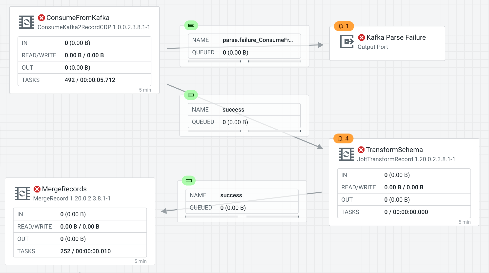

6. To make sure that our schema transformation works, we have to create a new _Record Writer Service_ and use it as the Record Writer for the _TransformSchema_ processor.

   Select the _TransformSchema_ processor and open the configuration panel. Scroll to the _Properties_ section, click the three dot menu in the _Record Writer_ row and select _Add Service_ to create a new Record Writer.

   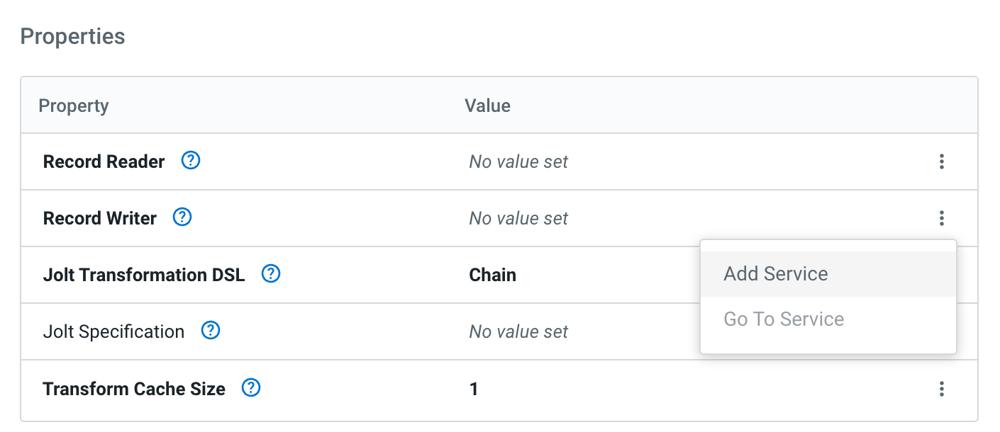

7. Select _AvroRecordSetWriter_, name it _TransformedSchemaWriter_ and click _Add_.

   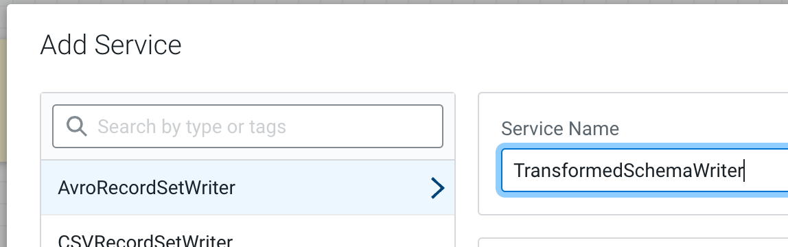

   Click _Apply_ in the configuration panel to save your changes.

8. Now click the three dot menu again and select _Go To Service_ to configure our new Avro Record Writer.

   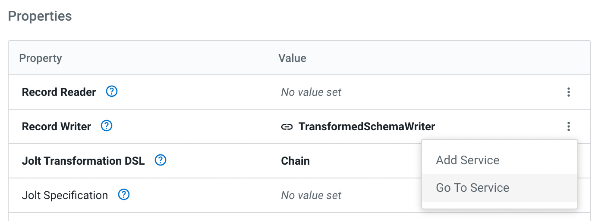

9. To configure our new Avro Record Writer, provide the following values:

| Name                   | Description                                             | Value                          |
| -----------------------| ------------------------------------------------------- | ------------------------------ |
| Schema Write Strategy  | Specify whether/how CDF should write schema information | **Embed Avro Schema**          |
| Schema Access Strategy | Specify how CDF identifies the schema to apply          | **Use ‘Schema Name’ Property** |
| Schema Registry        | Specify the Schema Registry that stores our schema      | **CDP_Schema_Registry**        |
| Schema Name            | The schema name to look up in the Schema Registry       | **syslog_transformed**         |

  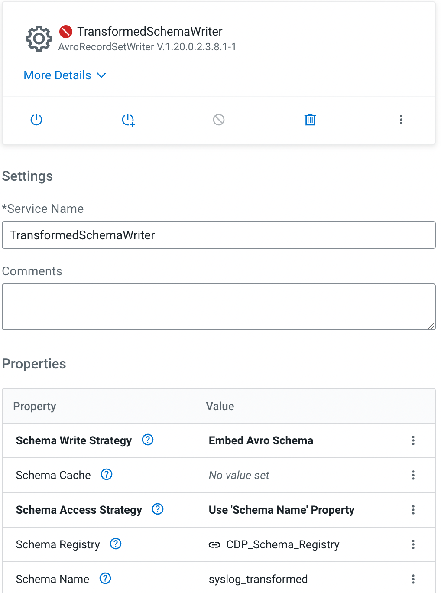

10. Convert the value that you provided for _Schema Name_ into a parameter. Click on the three dot menu in the _Schema Name_ row and select _Convert To Parameter_.

    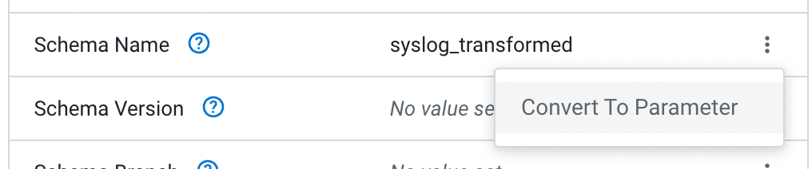  

11. Give the parameter the name _Schema Name Transformed_ and click “Add”. You have now created a new parameter from a value that can be used in more places in your data flow.

    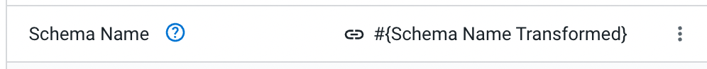

12. Apply your configuration changes and _Enable_ the Service by clicking the power icon. Now you have configured our new Schema Writer and we can return back to the Flow Designer canvas.

    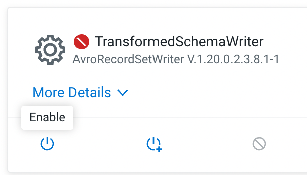  

13. In the configuration drawer, scroll down to the _Referencing Components_ section and click on _TransformSchema_ to get back to the canvas.

    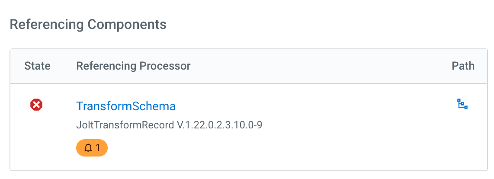

14. In the properties section, provide the following values:

| Name                   | Description                                                                                                                                                                | Value                       |
| -----------------------| -------------------------------------------------------------------------------------------------------------------------------------------------------------------------- | --------------------------- |
| Record Reader          | Service used to parse incoming events                                                                                                                                      | **AvroReader**              |
| Record Writer          | Service used to format outgoing events                                                                                                                                     | **TransformedSchemaWriter** |
| Jolt Specification     | The specification that describes how to modify the incoming JSON data. We are standardizing on lower case field names and renaming the timestamp field to event_timestamp. | \<Copy from below\>         |

```
[
  {
    "operation": "shift",
    "spec": {
      "appName": "appname",
      "timestamp": "event_timestamp",
      "structuredData": {
        "SDID": {
          "eventId": "structureddata.sdid.eventid",
          "eventSource": "structureddata.sdid.eventsource",
          "iut": "structureddata.sdid.iut"
        }
      },
      "*": {
        "@": "&"
      }
    }
    }
]
```

15. Scroll to _Relationships_ and select _Terminate_ for the failure, original relationships and click _Apply_.

    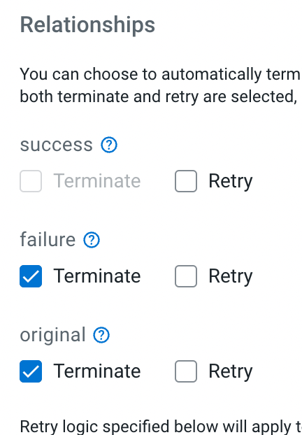

16. Start your _ConsumeFromKafka_ and _TransformSchema_ processors.

17. Validate that the transformed data matches our Iceberg table schema. Once events are queuing up in the connection between _TransformSchema_ and _MergeRecord_, right click the connection and select _List Queue_.

    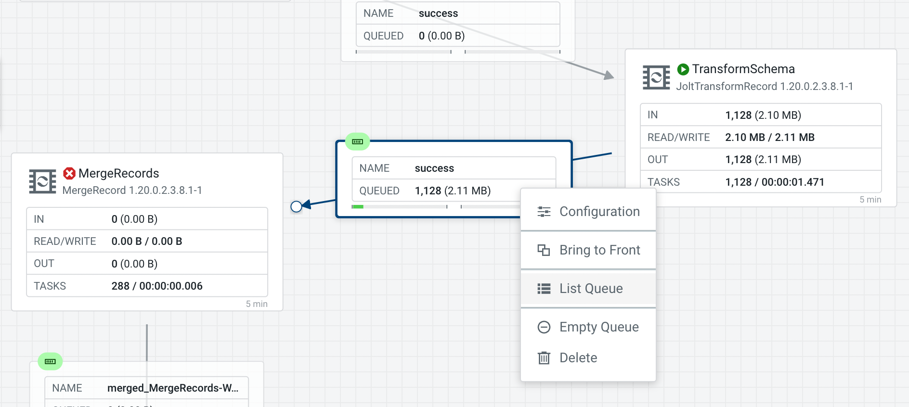

18. Select any of the queued files and select the book icon to open it in the Data Viewer

    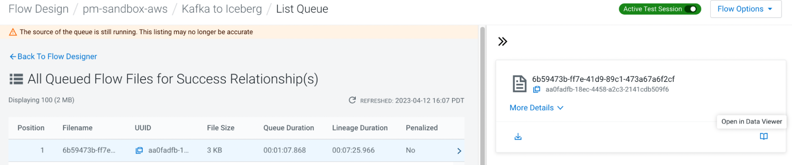

19. Notice how all field names have been transformed to lower case and how the _timestamp_ field has been renamed to _event_timestamp_.

    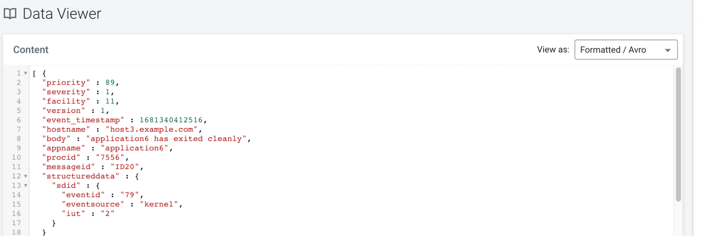

## 2.4 Merging records and start writing to Iceberg

Now that we have verified that our schema is being transformed as needed, it’s time to start the remaining processors and write our events into the Iceberg table. The _MergeRecords_ processor is configured to batch events up to increase efficiency when writing to Iceberg. The final processor, _WriteToIceberg_ takes our Avro records and writes them into a Parquet formatted table.

1. Select the _MergeRecords_ processor and explore its configuration. It is configured to batch events up for at least 5 minutes or until the queued up events have reached _Maximum Bin Size_ of 1GB.

   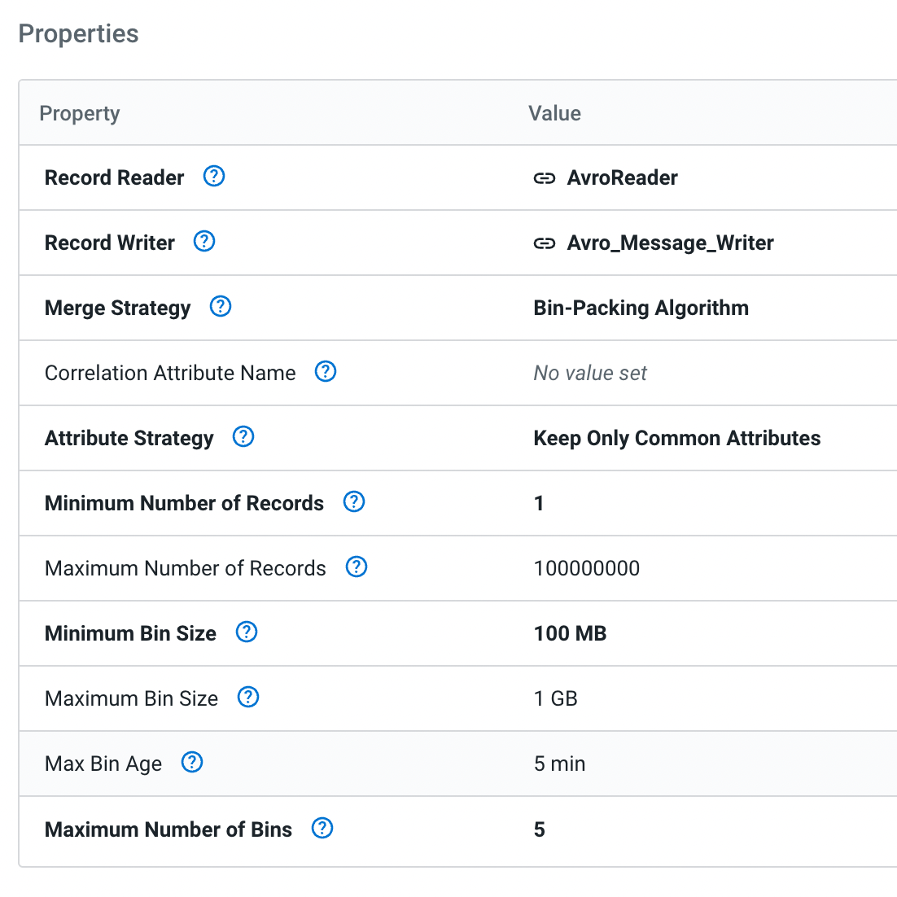

2. Start the _MergeRecords_ processor and verify that it batches up events and writes them out after 5 minutes. Tip: You can change the _Max Bin Age_ configuration to something like “30 sec” to speed up processing.

3. Select the _WriteToIceberg_ processor and explore its configuration. Notice how it relies on several parameters to establish a connection to the right database and table.

   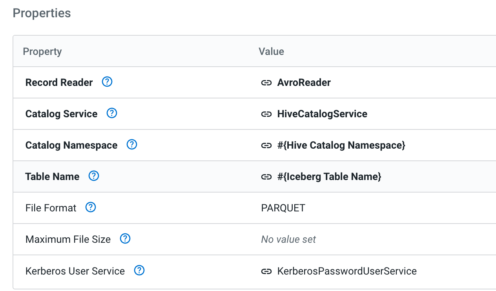

4. Start the _WriteToIceberg_ processor and verify that it writes records successfully to Iceberg. If the metrics on the processor increase and you don’t see any warnings or events being written to the _failure_WriteToIceberg_ connection, your writes are successful!

   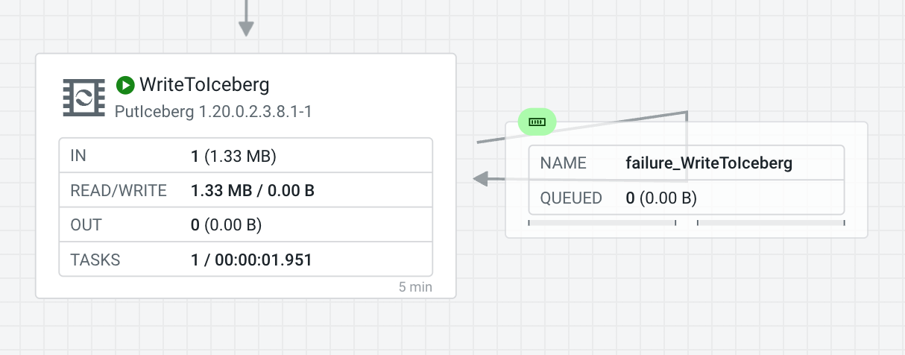

### Congratulations! With this you have completed the second use case. Feel free to publish your flow to the catalog and create a deployment.

---
**Info:**

The completed flow definition for this use case can be found in the Catalog under the name "Use Case 2 - Cloudera - Write critical syslog events to Iceberg".  If you run into issues during your flow development, it may be helpful to select this flow in the Catalog and select "Create New Draft" to open it in the Flow Designer to compare to your own.

---
