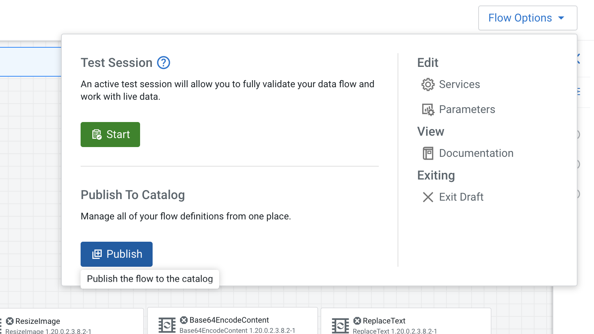

# Use Case 3 - Resize image flow deployed as server-less function

DataFlow Functions provides a new, efficient way to run your event-driven Apache NiFi data flows. You can have your flow executed within AWS Lambda, Azure Functions or Google Cloud Functions and define the trigger that should start its execution. isit the [Cloudera YouTube channel](https://youtu.be/oqaT7FDd0Fc?t=2579) for a video walkthrough of this use case.


DataFlow Functions is perfect for use cases such as:
- Processing files as soon as they land into the cloud provider object store
- Creating microservices over HTTPS
- CRON driven use cases

In this use case, we will be deploying a NiFi flow that will be triggered by HTTPS requests to resize images. Once deployed, the cloud provider will provide an HTTPS endpoint that you’ll be able to call to send an image, it will trigger the NiFi flow that will return a resized image based on your parameters.

The deployment of the flow as a function will have to be done within your cloud provider. Consequently this use case assumes that you have the permissions to deploy AWS Lambda / Azure Functions or Google Cloud Functions instances on your own cloud account.

---
**Note:**

This use case focuses on Functions in AWS. For information on running DataFlow Functions on Azure or GCP, follow these instructions:

[Functions in Azure](https://docs.cloudera.com/dataflow/cloud/azure-functions/topics/cdf-create-azure-function-app.html)

[Functions in Google Cloud](https://docs.cloudera.com/dataflow/cloud/google-cloud-functions/topics/cdf-create-google-cloud-function.html)

---

## 3.1 Designing the flow

### 3.1.1 Flow for AWS

1. Go into Cloudera DataFlow / Flow Design and create a new draft and name it _functions_flow_.
2. Drag and drop an Input Port named **input** onto the canvas. When triggered, AWS Lambda is going to inject a FlowFile into that input port containing the information about the HTTPS call that has been made.

 Example of payload that will be injected by AWS Lambda as a FlowFile:

 

3. Drag and drop an _EvaluateJsonPath_ processor. We’re going to use this to extract the HTTP headers that we want to keep in our flow. Add two properties configured as below. It’ll save as FlowFile’s attributes the HTTP headers (resize-height and resize-width) that we will be adding when making a call with our image to specify the dimensions of the resized image.

 ```
	resizeHeight => $.headers.resize-height
	resizeWidth => $.headers.resize-width
 ```

4. Change **Destination** to “flowfile-attribute” and click _Apply_.
5. Connect the input port to the _EvaluateJsonPath_ processor by hovering over the input port and dragging the arrow to the _EvaluateJsonPath processor_.

 

6. Drag and drop another _EvaluateJsonPath_ processor onto the canvas and name it _RetrieveContent_. This one will be used to retrieve the content of the body field from the payload we received and use it as the new content of the FlowFile. This field contains the actual representation of the image we have been sending over HTTP with Base 64 encoding.
7. Add a new property called _body_ with the value _$.body_

 ```
	body => $.body
 ```

 

8. Click _Apply_ to save your changes.

9. Connect the _EvaluateJsonPath_ processor to the _RetrieveContent_ processor and select the _matched_ relationship for the connection.

10. Drag and drop a _Base64EncodeContent_ processor onto the canvas and name it _DecodeContent_.

11. Change the mode to _Decode_ and click _Apply_. This will Base64 decode the content of the FlowFile to retrieve its binary format.

12. Connect the _RetrieveContent_ processor to the _DecodeContent_ processor and select the _matched_ relationship for the connection.

13. Drag and drop a _ResizeImage_ processor. Use the previously created FlowFile attributes to specify the new dimensions of the image.

 ```
 Image Width (in pixels) => ${resizeWidth}
 Image Height (in pixels) => ${resizeHeight}
 ```

14. Change the value for _Maintain aspect ratio_ from false to true.

15. Click _Apply_ to save your changes.

16. Connect the _DecodeContent_ processor to the _ResizeImage_ processor and select the _success_ relationship for the connection.

 

17. Drag and drop a _Base64EncodeContent_ processor onto the canvas and name it _EncodeContent_. To send back the resized image to the user, AWS Lambda expects us to send back a specific JSON payload with the Base 64 encoding of the image.

18. Connect the _ResizeImage_ processor to the _EncodeContent_ processor and select the _success_ relationship for the connection.

19. Drag and drop a _ReplaceText_ processor. We use it to extract the Base 64 representation of the resized image and add it in the expected JSON payload. Add the below JSON in “Replacement Value” .

 ```
 {
		"statusCode": 200,
		"headers": { "Content-Type": "image/png" },
		"isBase64Encoded": true,
		"body": "$1"
}
```

20. Change the “Evaluation Mode” property value to “Entire text” and click _Apply_ to save your changes.

21. Connect the _EncodeContent_ processor to the _ReplaceText_ processor and select the _success_ relationship for the connection.

22. Drag and drop an output port named **output**.

23. Connect the _ReplaceText_ processor to the _output_ port and select the _success_ relationship for the connection.

24. Validate that all your components are connected either with their _matched_ or _success_ connections. Auto-terminate all remaining unused relationships for all processors.

 

 The full flow should look something like this:

 

 You can now publish the flow into the DataFlow Catalog in the Flow Options menu:

 

 Make sure to give it a name that is unique (you can prefix it with your name):

 

 Once the flow is published, make sure to copy the CRN of the published version (it will end by /v.1):

 


## 3.2 Deploying the flow as a function

### 3.2.1 Gather prerequisites

First things first, go into DataFlow Functions and download the binary for running DataFlow Functions in AWS Lambda:


This should download a binary with a name similar to:

```
naaf-aws-lambda-1.0.0.2.3.9.0-24-bin.zip
```

Once you have the binary, make sure you also have:
- The CRN of the flow you published in the DataFlow Catalog
- The Access Key. Copy the value for 'dff_service_account_cdp_access_key' from Trial Manager homepage.
- The Private Key. Copy the value for 'dff_service_account_cdp_private_key' from Trial Manager homepage.

### 3.2.2 Creating the AWS Lambda function


In order to speed up the deployment, we’re going to leverage some scripts to automate the deployment. It assumes that your AWS CLI is properly configured locally on your laptop and you can use the jq command for reading JSON payloads. 

1. Create the Lambda function using the AWS CLI.   
Follow the script instructions [here](https://docs.cloudera.com/dataflow/cloud/quickstart-functions/topics/cdf-functions-qs-aws-lambda.html).

1. Create the Lambda function using the AWS Console.  
If you wish to deploy the flow in AWS Lambda manually, you can follow the steps described [here](https://docs.cloudera.com/dataflow/cloud/aws-lambda-functions/topics/cdf-create-aws-lambda-function.html).

### 3.2.3 Invoke the AWS Lambda function

1. Open the AWS Console UI and go to your Lambda.

2. Find the published version of the function and add an API Gateway trigger with the following configuration:

 

 Click _Add_.

3. This will give you the endpoint on which the Lambda is listening. For example:

 ```
 https://aa2q99qo3i.execute-api.eu-west-2.amazonaws.com/default/resizeimage
 ```

4. Send a request to your function using curl:

 ```
 curl -X POST https://aa2q99qo3i.execute-api.eu-west-2.amazonaws.com/default/resizeimage \
 -H "Content-Type: image/png" \
 -H "resize-width: 400" \
 -H "resize-height: 200" \
 --data-binary "@/Users/alim/Desktop/test.png" \
 --output /tmp/my_resized_image.png
 ```
 A resized image based on your parameters is created in your output directory.

 ---
 **Note:**

 The first attempt may fail due to a cold start and timeout (30 sec timeout on the API Gateway). A subsequent retry after a minute should work and should return the resized image much faster.

 The function will be open to the internet. Make sure to secure it if you want to keep it running (this is done when creating the API Gateway trigger) or delete everything once you are done.

 ---

### Congratulations! With this you have completed the third use case.
